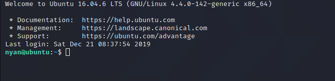

# CC Pen Testing: Section 7 - Final Exam

This will be a spoiler free write-up of how I completed the Final Exam of the
CC Pen Testing room in TryHackMe.

## Reconnaissance

After the machine started, I went to http://[IP_ADDRESS] to see if I would
get anything back. Got to see the following:

Really, the only thing I can deduce from that is that port 80 is open.

## Enumeration and Scanning

So, the next step was to look for other ports that might be available. Well,
I did two things at once, knowing that port 80 is open, on a separate
terminal I ran `gobuster` dir scan.

1. With the `nmap` scan, I made sure to cover all the ports, which hindsight
was probably unnecessary. However, I didn't want to let one slip by.

2. While the `gobuster` scan was going, it revealed a directory called
"secret."

3. Again, I attempted to just go to http://[IP_ADDRESS]/secret, and see if
anything would show. Alas, nothing did. Time to run another `gobuster`
within the directory! After failing to find anything, I decided to run
it again with the `-x` flag. Given the final flags are contained within
`.txt` files, I ran the command with `-x txt`. Wouldn't ya know it, it
worked!

4. Now, going to http://[IP_ADDRESS]/secret/secret.txt produced some
results.

## Exploitation

`nyan:046385855FC9580393853D8E81F240B66FE9A7B8` looks like useful information,
namely a username and a hash. I was a little lazy at this point, and intead
of using `hashcat` or `jtr`, I went to [CrackStation](https://crackstation.net)
to see if the Hash would produce any results.

Recalling from the nmap scan, port 22 is open, so time to SSH in, and hope that
username and unhashed word works for a password. Ran `ssh nyan@[IP_ADDRESS]`
and entered the password, and boom! Access!

Doing a simple `ls`, we see `user.txt` which was the first file we needed to
find! Success, just `cat user.txt` and bask in glory.

## Privilege Escalation

Now on to finding `root.txt`. First step was to run `ls -al` to see what else
is contained within this directory.

That `.sudo_as_admin_successful` is an odd file, and does not appear to have
anything in it. There also happens to be a `.bash_history`, which has 3
commands in it; `su`, `sudo su`, `exit`.

So, I tried running `sudo su`, and BAM!

After gaining root access, I did `ls /root/` and there is the precious gem
waiting to be `cat`ed.

## Conclusion

This was a fun introduction for capture the flag. I did not want to reveal
the flags, even with spoilers, so, if you're reading my walkthrough, you
can still execute the process. If you cheat, you're only cheating yourself.
